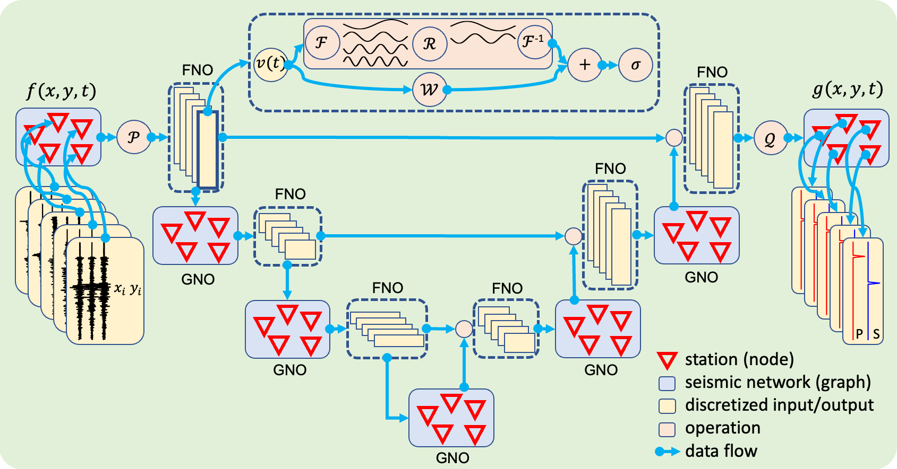

[](https://zenodo.org/doi/10.5281/zenodo.10224300)

# PhaseNO

Phase Neural Operator for Multi-Station Phase Picking from Dynamic Seismic Networks.

**StraboAI implementation as a package.**



## 1. Citation

```text
Sun, H., Ross, Z.E., Zhu, W. and Azizzadenesheli, K., 2023. Phase Neural Operator for Multi-Station Picking of Seismic Arrivals. arXiv preprint arXiv:2305.03269.
```

## 2. Installation

Create an environment with conda for PhaseNO

```bash
conda create -n phaseno
conda activate phaseno
python -m pip -e install .
```

## 3. Pre-trained model

Located in directory: models/*.ckpt

## 4. Example

Located in directory: example

- phaseno_predict.ipynb

  Use the pre-trained model to pick phases from one-hour continuous data of the 2019 Ridgecrest earthquake sequence.

- phaseno_plot.ipynb

  Plot the predicted probabilities and picks for all stations.
